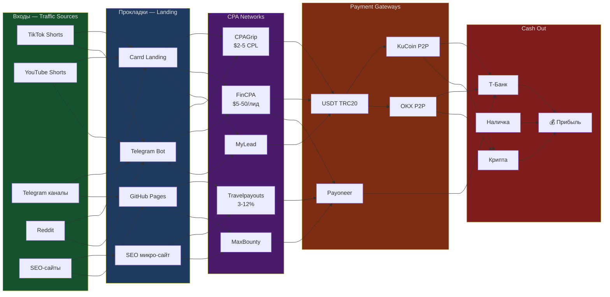

# Arbitrage Mindmap v2 — Spider Web

> ⚠️ **ВАЖНОЕ ПРАВИЛО (2026-07-14):**
> Пользователь (Александр) ЗАПРЕТИЛ сложные JS-визуализации без прямого запроса.
> - **ДЕФОЛТ:** три блока — только топ-3 маршрута, топ-3 блокера, 1 задача (см. references/three-block-format). Ноль JS.
> - Если пользователь явно запросил больше → простая HTML-таблица (Шаблон #0). Никаких внешних библиотек.
> - D3.js / Force Graph / интерактивный SVG — **ТОЛЬКО с явного одобрения**.
> - Критерий: «открыл и сразу понял, что делать дальше». Не «поигрался и закрыл».
> - Критерий: «можно отправить коллеге — и он тоже поймёт».

Арбитраж — это **сеть**, не конвейер. N источников трафика → M прокладок → K офферов → L платёжек. Любой узел может соединяться с любым.

Mindmap должен показывать **паутину связок**, а не линейную цепочку.

## Философия Spider Web

```
ВХОДЫ                    ПРОКЛАДКИ                 ОФФЕРЫ                  ПЛАТЁЖКИ                  ВЫХОДЫ
────────                 ──────────                ──────                  ────────                  ──────
TikTok ──┐                                       ┌─ CPAGrip ──┐                                  ┌─ Т-Банк
         ├──→ Telegram Bot ──→┐                  ├─ MyLead ───┼──→ USDT ──→ KuCoin P2P ──→┐       │
YouTube ─┤                   ├──→ Carrd Landing ──┤            │                              ├──────┤
         ├──→ GitHub Pages ──┤                   ├─ FinCPA ────┘                              │       ├──→ Наличка
Telegram ─┘                   └──→ SEO-сайт ────→ ┤                                            │       │
                                              ┌──→└─ Travelpayouts ──┐                        │       └──→ Крипта
Reddit ───────→                               │                     ├──→ Wire/Payoneer ────────┤
                                              │                     │                         │
Pinterest ────→ Instagram Bot ────────────────┘  └──────────────────┘                         │
                                                                                              │
SEO-сайты ──→  ...                             ...                               ...         │
```

Каждый узел — это связка. Узлы можно комбинировать в любом порядке.

## Когда что использовать (приоритет)

| Формат | Для чего | Когда использовать |
|--------|----------|-------------------|
| **Три блока** (reference: three-block-format) | **ДЕФОЛТ.** Ответить на три вопроса: топ-3 маршрута, топ-3 блокера, 1 задача сегодня | **Всегда сначала.** Когда пользователь хочет «управлять, а не изучать». НОЛЬ JS. |
| **Простая HTML-таблица** (Шаблон #0) | Показать все маршруты с цифрами и статусами | Когда пользователь явно запросил список/таблицу |
| **Mermaid Flowchart** | Кластерная карта: группы узлов и их типовые связи | Как дополнение к таблице, если нужно показать топологию |
| **D3.js Force Graph** (HTML) | Полная интерактивная паутина | **ТОЛЬКО с явного одобрения пользователя** |
| **Markmap** | Иерархия "что есть что" (без связей между ветками) | Дерево всех доступных ресурсов по категориям |
| **Excalidraw** | Конкретная схема для презентации/обсуждения | Hand-drawn, аккуратно размеченная |

## Шаблон #0: Простая HTML-таблица (ДЕФОЛТ)

Самодостаточный .html без внешних зависимостей. Открывается в любом браузере.

**Структура:**
- Таблица с колонками: Источник → Прокладка → Оффер → Платёжка → Вывод → ROI → Статус → Что делать
- Цветная маркировка строк: зелёная (готово), жёлтая (тест), красная (блок), серая (не тестировано)
- Фильтр по статусу через `<select>` (чистый JS, строк 10-15)
- Сводка сверху: сколько готово / тест / блок
- Никаких внешних библиотек (CDN, D3, jQuery)

**Пример реализации:** `reports/arbitrage-table.html` (для Александр·Крым)

**Шаблон кода (минимальный):**
```html
<!DOCTYPE html>
<html lang="ru">
<head><meta charset="utf-8">
<style>
body{font-family:system-ui;background:#0d0d1a;color:#e0e0e0;margin:20px}
table{width:100%;border-collapse:collapse;background:#111128}
th{background:#1a1a30;color:#888;font-size:11px;text-transform:uppercase;padding:10px 12px}
td{padding:10px 12px;border-bottom:1px solid #1a1a2a;font-size:13px}
tr.ready td:first-child{border-left:3px solid #4ade80}
tr.testing td:first-child{border-left:3px solid #facc15}
tr.blocked td:first-child{border-left:3px solid #f87171}
</style>
</head>
<body>
<h1>🕸 МАРШРУТЫ</h1>
<div class="filters">
  <select id="filter" onchange="filterRows()">
    <option value="all">Все</option>
    <option value="ready">✅ Готово</option>
    <option value="testing">🔄 Тест</option>
    <option value="blocked">⛔ Блок</option>
  </select>
</div>
<table id="routes">
<thead><tr><th>Источник</th><th>Оффер</th><th>ROI</th><th>Статус</th><th>Действие</th></tr></thead>
<tbody>
  <!-- строки с class="ready|testing|blocked" -->
</tbody>
</table>
<script>
function filterRows(){
  var v = document.getElementById('filter').value;
  document.querySelectorAll('#routes tbody tr').forEach(function(r){
    r.style.display = (v === 'all' || r.className === v) ? '' : 'none';
  });
}
</script>
</body></html>
```

## Шаблон #1: D3.js Force-Directed Graph (⚠️ ТОЛЬКО С ОДОБРЕНИЯ)

Создавай HTML-файл с force-directed graph, когда нужно показать **все** связки сразу.

```html
<!DOCTYPE html>
<html>
<head><meta charset="utf-8"><title>Arbitrage Spider Web</title>
<style>
body{margin:0;background:#0d0d1a;overflow:hidden;font-family:system-ui}
.link{stroke-opacity:0.4;fill:none}
.link.traffic{stroke:#4ade80}
.link.proxy{stroke:#60a5fa}
.link.offer{stroke:#c084fc}
.link.payment{stroke:#fb923c}
.link.exit{stroke:#f87171}
.node circle{stroke:#fff;stroke-width:1.5;cursor:grab}
.node text{fill:#e0e0e0;font-size:11px;pointer-events:none;text-shadow:0 0 4px #000}
.node.traffic circle{fill:#22c55e}
.node.proxy circle{fill:#3b82f6}
.node.offer circle{fill:#a855f7}
.node.payment circle{fill:#f97316}
.node.exit circle{fill:#ef4444}
.node.income circle{fill:#eab308}
</style>
</head>
<body>
<svg id="svg" style="width:100vw;height:100vh"></svg>
<script src="https://cdn.jsdelivr.net/npm/d3@7"></script>
<script>
// ======== УЗЛЫ (добавляй/убирай под свою сеть) ========
const nodes = [
  // ВХОДЫ - трафик
  {id:"tiktok", group:"traffic", label:"TikTok Shorts"},
  {id:"youtube", group:"traffic", label:"YouTube Shorts"},
  {id:"telegram", group:"traffic", label:"TG каналы (Крым)"},
  {id:"reddit", group:"traffic", label:"Reddit"},
  {id:"seo", group:"traffic", label:"SEO-сайты"},
  {id:"pinterest", group:"traffic", label:"Pinterest"},
  
  // ПРОКЛАДКИ
  {id:"carrd", group:"proxy", label:"Carrd Landing"},
  {id:"tgbot", group:"proxy", label:"Telegram Bot"},
  {id:"ghpages", group:"proxy", label:"GitHub Pages"},
  {id:"seosite", group:"proxy", label:"SEO-микро-сайт"},
  
  // CPA/OFFERS
  {id:"cpagrip", group:"offer", label:"CPAGrip $2-5 CPL"},
  {id:"mylead", group:"offer", label:"MyLead"},
  {id:"fincpa", group:"offer", label:"FinCPANetwork $5-50"},
  {id:"travel", group:"offer", label:"Travelpayouts 3-12%"},
  {id:"maxbounty", group:"offer", label:"MaxBounty"},
  
  // ПЛАТЁЖКИ
  {id:"usdt", group:"payment", label:"USDT (TRC20)"},
  {id:"kucoin", group:"payment", label:"KuCoin P2P"},
  {id:"okx", group:"payment", label:"OKX P2P"},
  {id:"payoneer", group:"payment", label:"Payoneer"},
  
  // ВЫХОДЫ
  {id:"tbank", group:"exit", label:"Т-Банк карта"},
  {id:"cash", group:"exit", label:"Наличка"},
  {id:"crypto", group:"exit", label:"Крипта"},
  
  // ПРИБЫЛЬ
  {id:"profit", group:"income", label:"💰 $50-200/день"},
];

// ======== СВЯЗИ (настраивай под свою сеть) ========
const links = [
  // Трафик → прокладки
  {source:"tiktok", target:"carrd", group:"traffic"},
  {source:"tiktok", target:"tgbot", group:"traffic"},
  {source:"youtube", target:"carrd", group:"traffic"},
  {source:"telegram", target:"tgbot", group:"traffic"},
  {source:"telegram", target:"carrd", group:"traffic"},
  {source:"reddit", target:"ghpages", group:"traffic"},
  {source:"reddit", target:"seosite", group:"traffic"},
  {source:"seo", target:"seosite", group:"traffic"},
  {source:"pinterest", target:"carrd", group:"traffic"},
  
  // Прокладки → офферы
  {source:"carrd", target:"cpagrip", group:"proxy"},
  {source:"tgbot", target:"fincpa", group:"proxy"},
  {source:"tgbot", target:"mylead", group:"proxy"},
  {source:"ghpages", target:"maxbounty", group:"proxy"},
  {source:"seosite", target:"travel", group:"proxy"},
  {source:"seosite", target:"cpagrip", group:"proxy"},
  
  // Офферы → платёжки
  {source:"cpagrip", target:"usdt", group:"offer"},
  {source:"mylead", target:"usdt", group:"offer"},
  {source:"fincpa", target:"usdt", group:"offer"},
  {source:"fincpa", target:"payoneer", group:"offer"},
  {source:"travel", target:"payoneer", group:"offer"},
  {source:"maxbounty", target:"payoneer", group:"offer"},
  
  // Платёжки → выходы
  {source:"usdt", target:"kucoin", group:"payment"},
  {source:"usdt", target:"okx", group:"payment"},
  {source:"kucoin", target:"tbank", group:"payment"},
  {source:"okx", target:"tbank", group:"payment"},
  {source:"payoneer", target:"tbank", group:"payment"},
  {source:"kucoin", target:"crypto", group:"payment"},
  
  // Выходы → прибыль
  {source:"tbank", target:"profit", group:"exit"},
  {source:"cash", target:"profit", group:"exit"},
  {source:"crypto", target:"profit", group:"exit"},
];

// ======== D3 Force ========
const width = window.innerWidth, height = window.innerHeight;
const svg = d3.select("#svg");

// Arrow markers per group
const markers = {traffic:"#4ade80", proxy:"#60a5fa", offer:"#c084fc", payment:"#fb923c", exit:"#f87171"};
Object.entries(markers).forEach(([g,c]) => {
  svg.append("defs").append("marker")
    .attr("id","arrow-"+g).attr("viewBox","0 -5 10 10").attr("refX",20).attr("refY",0)
    .append("path").attr("d","M0,-5L10,0L0,5").attr("fill",c);
});

const link = svg.append("g").selectAll("line").data(links).join("line")
  .attr("class", d => "link "+d.group)
  .attr("stroke", d => markers[d.group])
  .attr("marker-end", d => "url(#arrow-"+d.group+")");

const node = svg.append("g").selectAll("g").data(nodes).join("g")
  .attr("class", d => "node "+d.group)
  .call(d3.drag()
    .on("start", (e,d) => {if(!e.active) sim.alphaTarget(0.3).restart(); d.fx=d.x; d.fy=d.y;})
    .on("drag", (e,d) => {d.fx=e.x; d.fy=e.y;})
    .on("end", (e,d) => {if(!e.active) sim.alphaTarget(0); d.fx=null; d.fy=null;}));

node.append("circle").attr("r", d => d.group==="income" ? 20 : 12);
node.append("text").attr("dx", 16).attr("dy", 4).text(d => d.label);

const sim = d3.forceSimulation(nodes)
  .force("link", d3.forceLink(links).id(d => d.id).distance(150))
  .force("charge", d3.forceManyBody().strength(-300))
  .force("center", d3.forceCenter(width/2, height/2))
  .force("collide", d3.forceCollide(40))
  .on("tick", () => {
    link.attr("x1",d=>d.source.x).attr("y1",d=>d.source.y)
        .attr("x2",d=>d.target.x).attr("y2",d=>d.target.y);
    node.attr("transform",d=>"translate("+d.x+","+d.y+")");
  });
</script>
</body></html>
```

Как использовать:
1. Отредактируй узлы (nodes) под свою сеть
2. Отредактируй связи (links) под свои связки
3. Сохрани как `arbitrage-web.html` на D:
4. Открой в браузере — получишь интерактивную паутину

## Шаблон #2: Mermaid Cluster Map

Когда нужно показать категории узлов и связи между ними:



## Как плести паутину (процедура)

1. **Собери ВСЕ узлы** — выпиши всё что есть:
   - Источники трафика (5-15 шт)
   - Прокладки/лендинги (3-10 шт)
   - CPA-сети/офферы (5-20 шт)
   - Платёжные методы (3-8 шт)
   - Банки/вывод (2-5 шт)
   - Цель/прибыль

2. **Соедини связями** — каждый вход может вести к любой прокладке, каждая прокладка к любому офферу и т.д.

3. **Выбери формат**:
   - Надо показать всё сразу → **D3.js force graph** (HTML)
   - Надо показать кластеры → **Mermaid с subgraph**
   - Надо показать иерархию ресурсов → **Markmap**
   - Надо нарисовать конкретную связку детально → **Excalidraw**

4. **Сохрани** как `D:/Portable_Soft/hermes/reports/arbitrage-web-{дата}.html`

## GEO-матрица (все биржи для вывода)

| Платёжка | Крым | РФ | Global |
|----------|------|-----|--------|
| Binance P2P | ❌ | ✅ | ✅ |
| Bybit P2P | ❌ | ✅ | ✅ |
| **KuCoin P2P** | **✅** | ✅ | ✅ |
| OKX P2P | ✅ | ✅ | ✅ |
| Payoneer | ✅ | ✅ | ✅ |
| USDT (TRC20) | ✅ | ✅ | ✅ |

## Питфоллы

- **⚠️ НЕ ДЕЛАЙ СЛОЖНЫЙ UI БЕЗ ЗАПРОСА.** Пользователь сказал: «Ты не имеешь права создавать сложный UI-код без моего прямого запроса». Начинай с **трёх блоков** (references/three-block-format). Никаких таблиц, JS, D3. Если пользователь явно запросил больше — переходи к простой HTML-таблице. D3.js/force graph/SVG — только после одобрения.
- **⚠️ НЕ СТАВЬ ФАНТАСТИЧЕСКИЕ ЦИФРЫ.** Пользователь: «Цифры вроде '$2 075/день' для несуществующей кампании — это просто сказка. Убери их.» Показывай только реальные первые шаги: время и стоимость (обычно 0₽ и 15-30 мин). Никаких прогнозов дохода для незапущенных кампаний.
- **Не зацикливайся на одной бирже/источнике** — арбитраж = сеть, не цепочка
- **Не рисуй линейные pipeline** для сложных схем — получается ложно-оптимистичная картина
- **Force graph не сохраняет позиции** — при перезагрузке узлы перераспределяются. Если нужна фиксированная схема — Excalidraw
- **Markmap не умеет cross-connection** — только иерархия. Для связей между ветками используй Mermaid/Force
- **D3 force = много узлов в браузере** — при 50+ узлах может тормозить. Дели на кластеры

## Связанные reference

- `references/three-block-format.md` — **ДЕФОЛТНЫЙ ФОРМАТ**: три блока, ноль JS, только топ-3 маршрута/блокера/задача
- `templates/simple-arbitrage-table.html` — готовый шаблон простой HTML-таблицы (когда трёх блоков недостаточно)
- `references/alexander-crimea-spider-web.md` — кастомная паутина для Крыма (Alexander-specific): KuCoin P2P, Тинькофф CPA, TikTok/YouTube Shorts. D3.js HTML в `reports/arbitrage-spider-web.html` (черновик, не для продакшена).
- `references/3d-spider-web-guide.md` — 3D-визуализация
- `references/router-guide.md` — роутинг трафика
