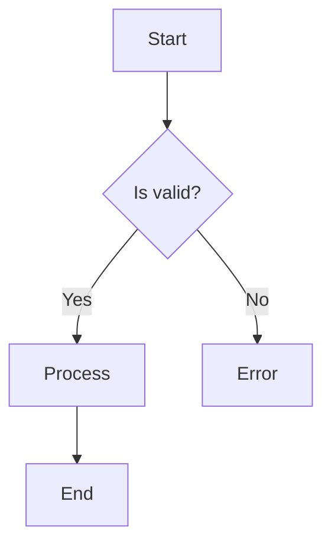
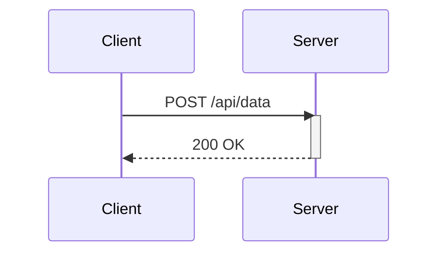

# Diagram Maker

Generate production-ready, syntactically correct Mermaid diagrams from natural language descriptions.

## Model-Before-Execution Workflow (User Requirement 2026-07-24)
**Before proposing any new scheme (monetization pipeline, channel flip, CPA system):**

User demand: "сначала её ссмоделируй и покажи как это будет" — model architecture first, show concrete examples, THEN execute.

### Workflow:
1. **Architecture model** — Mermaid flowchart showing all stages (Research → Content → Growth → Monetize)
2. **Content matrix** — table with specific post formats, niches, example headlines
3. **Concrete outputs** — generate actual files (HTML posts, example images, templates)
4. **Revenue model** — numbers table: costs, timeline, ROI, scaling
5. **What user needs to do** — minimal steps (1-minute checklist)

### Anti-pattern:
- ❌ Open with "I could do X, but I need Y first" — leads with blocker
- ❌ Verbal description without diagram — user can't see the pipeline
- ❌ Generic suggestions — "Pinterest" without specific niche, pins, examples
- ✅ Mermaid diagram + generated content files + numbers table = user can say "do it" immediately

## When to Use

- User asks for a diagram, flowchart, architecture overview
- Need to visualize a process, workflow, or decision tree
- Want to document system architecture
- Need sequence diagrams for API interactions
- User mentions "can you draw/show me..."

## Map Diagram Type Selection

| User Intent | Diagram Type | Declaration |
|---|---|---|
| Process, workflow, decisions | **Flowchart** | `flowchart TD` or `flowchart LR` |
| API calls, request/response | **Sequence** | `sequenceDiagram` |
| Object relationships | **Class** | `classDiagram` |
| Database tables/relationships | **ER** | `erDiagram` |
| State transitions | **State** | `stateDiagram-v2` |
| Timeline, milestones | **Gantt** | `gantt` |
| Proportions | **Pie** | `pie` |
| Git branching | **Git Graph** | `gitGraph` |
| User journey | **Journey** | `journey` |
| System context | **C4** | `C4Context` |
| Nested hierarchy | **Mindmap** | `mindmap` (Mermaid) or markmap.js |
| Release timeline | **Timeline** | `timeline` |

Default: `flowchart TD` when ambiguous. Use `flowchart LR` for pipelines.

## Markmap (Interactive Mindmap from Markdown)

For hierarchical/nested data (project maps, knowledge trees, org charts), use **markmap.js** instead of Mermaid mindmap. Markmap renders standard markdown headings as an interactive, zoomable, foldable mindmap in the browser.

### When Markmap over Mermaid Mindmap
| Situation | Choose |
|---|---|
| Simple 2-3 level hierarchy | Mermaid `mindmap` (inline, no browser) |
| Deep hierarchy (4+ levels), interactive, user will explore | Markmap (browser, zoomable) |
| Content already written as markdown headings | Markmap (zero extra syntax) |
| Need to embed in a page/document | Markmap (self-contained HTML) |
| Need fold/collapse, user interaction | Markmap (interactive by default) |

### Markmap Procedure

1. **Structure** content as a markdown file using heading hierarchy only:
   ```markdown
   # Root Title
   ## Theme A
   ### Project 1
   #### Detail
   #### Status
   ### Project 2
   ## Theme B
   ```
2. **Create HTML viewer** loading markmap.js from CDN:
   ```html
   <script src="https://cdn.jsdelivr.net/npm/d3@7"></script>
   <script src="https://cdn.jsdelivr.net/npm/markmap-lib/dist/browser/index.js"></script>
   <script src="https://cdn.jsdelivr.net/npm/markmap-view/dist/browser/index.js"></script>
   ```
3. **Embed markdown** as a JS template literal (avoids CORS issues on `file://`):
   ```js
   const MARKDOWN = `# Root\n## Theme\n### Project`.trim();
   const { Transformer } = window.markmap;
   const { root } = new Transformer().transform(MARKDOWN);
   window.mm = window.markmap.Markmap.create('#selector', options, root);
   ```
4. **Style** via CSS in options:
   ```js
   window.markmap.Markmap.create('#svg', {
     colorFreezeLevel: 2,
     maxWidth: 300,
     duration: 500,
     style: ['svg { background: #000; }', '.markmap-node text { fill: white; }']
   }, root);
   ```

### Markmap Options

| Option | Default | Description |
|--------|---------|-------------|
| `colorFreezeLevel` | 2 | Nodes at this depth get fixed colors |
| `maxWidth` | 300 | Max text width before wrapping |
| `spacingHorizontal` | 10 | Horizontal gap between nodes |
| `spacingVertical` | 5 | Vertical gap between lines |
| `nodeFont` | system-ui | Font for node text |
| `nodeMinHeight` | 22 | Min node height |
| `duration` | 500 | Animation duration (ms) |
| `zoom` | true | Enable zoom/pan |
| `pan` | true | Enable pan |
| `style` | [] | Array of CSS strings for custom styling |

### Markmap Pitfalls

- **CORS on `file://`**: JS fetch of markdown file fails from local HTML. Either (a) embed markdown as template literal, or (b) serve via any HTTP server.
- **Library version**: `markmap-lib` provides `Transformer`, `markmap-view` provides `Markmap.create`. Both from CDN.
- **Deep nesting**: 6+ levels become unreadable. Keep max 4-5 levels.
- **Long text**: Nodes wrap at `maxWidth`. Keep text short (<50 chars per line).
- **Character encoding**: Emoji and Unicode work fine in SVG.

### Markmap Verification

- Page loads without JS console errors
- Root node visible, expandable
- All heading levels render as tree branches
- Collapse/expand works
- Zoom + pan: Fit, In, Out buttons function
- Mobile: touch zoom works (markmap handles this natively)

## Key Rules

1. **Quote labels with special chars** — `()` `,` `:` `"` must be quoted
2. **No HTML tags** — use newlines inside quoted strings instead of `<br>`
3. **Avoid reserved words** — `end`, `graph`, `subgraph`, `style`, `class` as node IDs
4. **Match brackets** — `[text]`, `(text)`, `{text}`, `((text))`, `[(text)]`, `([text])`
5. **Consistent arrows** — `-->`, `---`, `-.->`, `==>`, `--text-->`
6. **Subgraph structure** — every `subgraph` needs `end`
7. **No trailing semicolons**
8. **Keep it readable** — max 30 nodes per diagram, use subgraphs
9. **PNG alternative:** `references/diagrams-png-alternative.md` — Python `diagrams` (mingrammer) for standalone PNGs when Mermaid inline code won't work

## Procedure

1. Identify diagram type from the request
2. Plan structure — list nodes and relationships first
3. Write following the syntax rules
4. Self-validate every label, arrow, and bracket
5. Output in fenced ` ```mermaid ` code block
6. Split if >30 nodes into multiple focused diagrams

## Examples

### Flowchart (process)


### Sequence (API calls)


## Verification

- All labels with special chars are quoted
- No reserved words used as node IDs
- All brackets are matched
- Every subgraph has `end`
- No trailing semicolons
- Diagram renders in standard Mermaid renderers
