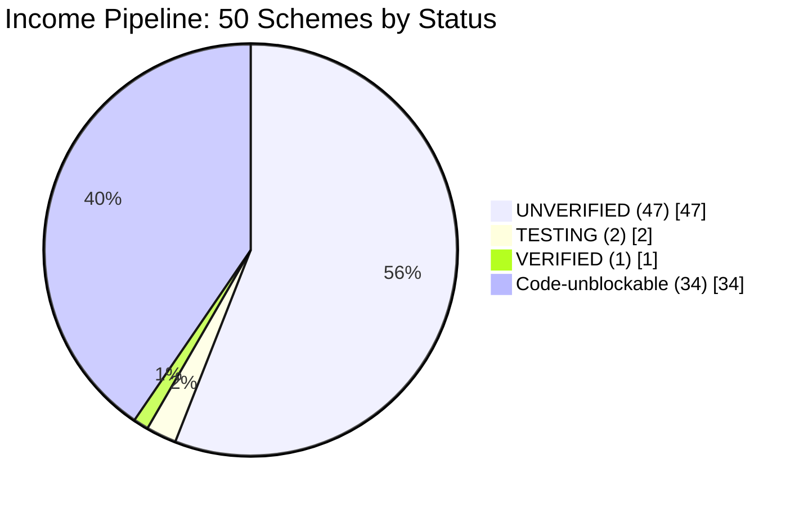
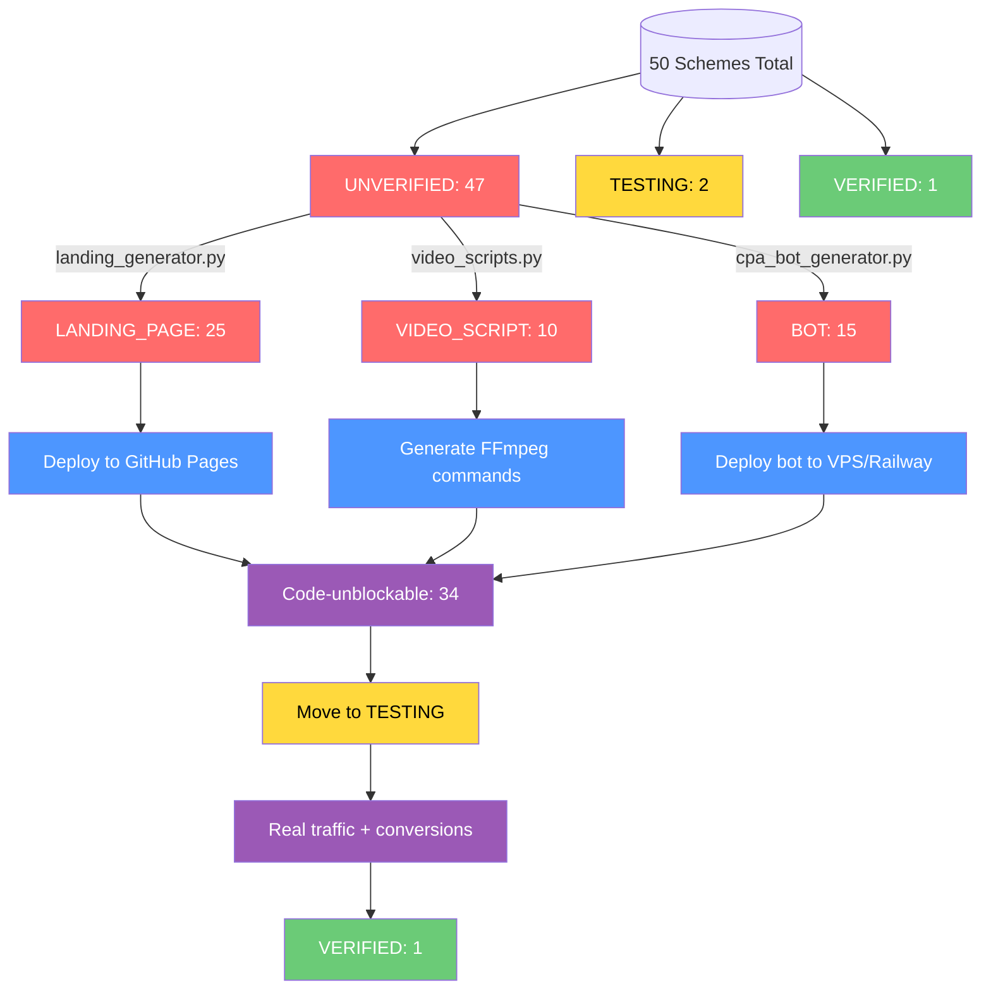
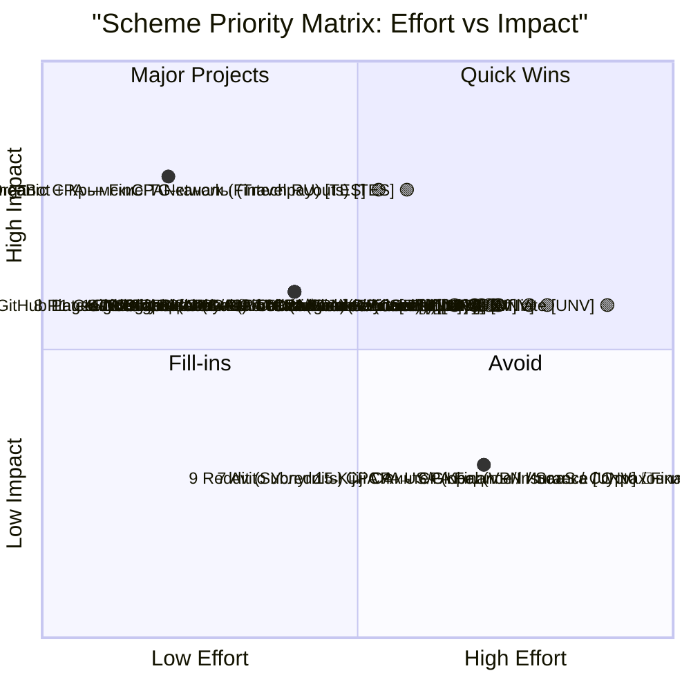

# Mermaid Visualizations Reference

Generated by `scripts/income_status_report.py` → `reports/income_pipeline_status.md`

## 1. Scheme Status Distribution (Pie Chart)



**Colors:**
- UNVERIFIED: `#ff6b6b` (red)
- TESTING: `#ffd93d` (yellow)
- VERIFIED: `#6bcb77` (green)
- Code-unblockable: `#4d96ff` (blue)

**Function:** `generate_mermaid_status_pie(total, unverified, testing, verified, code_fixable)`

---

## 2. Blocker Distribution (Horizontal Bar Chart)

```mermaid
bar
    title Blocker Distribution (UNVERIFIED schemes)
    "AD BUDGET" : 47
    "LANDING PAGE" : 25
    "BOT" : 15
    "VIDEO SCRIPT" : 10
    "MANUAL ACCOUNT" : 9
    "API KEY" : 4
```

**Colors:**
- Code-fixable (LANDING_PAGE, VIDEO_SCRIPT, BOT): `#4d96ff` (blue)
- User-action (AD_BUDGET, MANUAL_ACCOUNT, API_KEY): `#999` (gray)

**Function:** `generate_mermaid_blocker_bar(blocker_counts)`

---

## 3. Pipeline Flow (Flowchart TD)



**Function:** `generate_mermaid_pipeline_flow(total, unverified, testing, verified, code_fixable, blocker_counts)`

---

## 4. Priority Matrix (Quadrant Chart)



**Color coding:**
- 🟢 = Code-unblockable (can be deployed via scripts)
- 🔴 = Requires manual user action

**Quadrant interpretation:**
- **Quick Wins (top-left):** Low effort, high impact → Do first (FinCPANetwork, HotelCrimeaBot)
- **Major Projects (top-right):** High effort, high impact → Plan & invest (Admitad, TikTok, Pinterest)
- **Fill-ins (bottom-left):** Low effort, low impact → If time permits
- **Avoid (bottom-right):** High effort, low impact → Skip (Avito chat, Reddit moderation, Kijiji FR)

**Function:** `generate_mermaid_scheme_matrix(schemes)`

---

## Usage in Autonomous Mission

The MISSION.md triggers `income_status_report.py` on boot and on `knowledge_added` events. The Mermaid diagrams render natively in:
- GitHub markdown files
- VS Code Markdown Preview (`Ctrl+Shift+V`)
- Obsidian
- Any Mermaid-compatible viewer

For standalone browser viewing (no GitHub needed), use the HTML dashboard:
```bash
python scripts/generate_dashboard.py
# Open reports/income_pipeline_dashboard.html in browser
```

---

## 5. Full Pipeline Flow Visualization (Standalone HTML)

**File:** `reports/income_pipeline_flow.html` (generated by `scripts/generate_flowchart.py`)

- **Mermaid.js via CDN** — renders directly in browser, no build step
- **Left-to-right flow**: Sources (15 groups) → Proxies (5 groups) → Offers (14 groups) → Withdrawal (4 groups)
- **All 50 schemes** individually rendered with status color (🔴 UNVERIFIED / 🟡 TESTING / 🟢 VERIFIED)
- **Aggregate edges** with scheme counts per group
- **Interactive controls**: Pan/zoom, download SVG/PNG, fit-to-screen, regenerate reminder
- **Opens directly** in any browser: `file://D:/Portable_Soft/hermes/reports/income_pipeline_flow.html`

**Generator:** `scripts/generate_flowchart.py` — reads ARBITRAGE_BONDS.md, outputs standalone HTML with embedded mermaid definition.