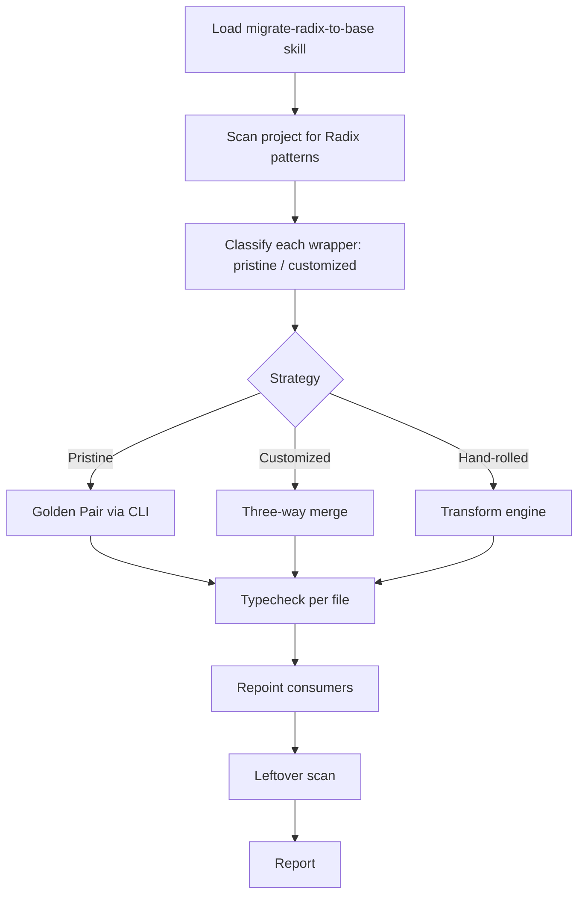

# shadscan — Deterministic UI Audits for shadcn Apps

> **Two ways to use:**
> 1. **CLI** — `npx shadscan` in any shadcn project (terminal, CI, local)
> 2. **Agent Skills** — `.agents/skills/shadcn` + `migrate-radix-to-base` for AI agents

---

## What Is shadscan?

shadscan is a **deterministic auditor** for shadcn/ui projects. It doesn't guess — it checks your actual code against the official shadcn rules (Radix) or Base UI migration rules.

### Two Usage Modes

| Mode | How | Use When |
|------|-----|----------|
| **CLI** | `npx shadscan` or `npx shadscan migrate` | Terminal, CI, pre-commit, one-off audits |
| **Agent Skills** | Load `.agents/skills/shadcn` or `migrate-radix-to-base` | AI agent working in the project |

---

## Quick Start (CLI)

```bash
# In any shadcn project
npx shadscan

# Output: violations grouped by rule file, with file:line, fix hint
# Exit code: 0 = clean, 1 = violations found
```

```bash
# Base UI migration audit
npx shadscan migrate
# Checks: asChild→render, part renames, prop renames, behavior deltas, class mappings
```

### CI Integration
```yaml
# .github/workflows/ui-audit.yml
- name: shadscan
  run: npx shadscan --ci
```

---

## Agent Skills (This Directory)

This skill directory contains **two skill families** for AI agents:

### 1. `shadcn` — General shadcn/ui Development
- **SKILL.md** (this file) — entry point
- **agents/** — OpenAI agent configs for specialized tasks
- **assets/** — shadcn logo assets
- **cli.md** — CLI usage reference
- **customization.md** — customizing components safely
- **evals/evals.json** — test cases for agent evaluation
- **mcp.md** — MCP server for real-time registry access
- **registry.md** — component registry patterns
- **rules/** — critical rules (link to reference files)
  - styling.md → `references/styling.md`
  - forms.md → `references/forms.md`
  - composition.md → `references/composition.md`
  - icons.md → `references/icons.md`
  - chat.md → `references/chat.md`
  - cli.md → `references/cli.md`

### 2. `migrate-radix-to-base` — Radix → Base UI Migration
- **SKILL.md** (in `.agents/skills/migrate-radix-to-base/`) — entry point
- **class-mapping.md** — `references/class-mapping.md`
- **consumer-props.md** — `references/consumer-props.md`
- **evals/evals.json** — migration-specific evals

---

## Reference Files (All in `references/`)

| File | Purpose |
|------|---------|
| `styling.md` | Semantic tokens, spacing, sizing, truncate, overlay stacking, typography |
| `forms.md` | FieldGroup+Field, validation, InputGroup, ToggleGroup, Checkbox/Radio grouping |
| `composition.md` | Item-in-Group, full Card/Dialog/Select composition, asChild/render, use components not markup |
| `icons.md` | data-icon, no sizing classes, pass as objects |
| `chat.md` | MessageScroller+Message+Bubble, streaming, attachments, markers |
| `cli.md` | Preset decode/url/open/apply, apply preset codes, preset resolve |
| `base-vs-radix.md` | **Migration** — asChild→render, part renames, prop renames, behavior deltas, three-way merge |
| `consumer-props.md` | **Migration** — call-site changes for wrapper consumers |
| `class-mapping.md` | **Migration** — data-radix→data-base, slot renames, CSS variable prefixes |

---

## Rules Loading (How Agent Uses This)

```yaml
# In agent prompt or skill loader:
skills:
  - shadscan/shadcn
  # or
  - shadscan/migrate-radix-to-base
```

When loaded, the agent:
1. Reads this SKILL.md
2. Loads all `references/*.md` as **enforced rules**
3. Runs `evals/evals.json` test cases to verify compliance
4. Audits code deterministically (no hallucination)

---

## Evals (Quality Gate)

```bash
# Run evals locally
npx shadscan eval

# Or via agent: each skill has evals/evals.json
# Agent must pass evals before claiming compliance
```

### Eval Categories
| Category | Description |
|----------|-------------|
| `styling` | Semantic tokens, no raw colors, spacing/sizing rules |
| `forms` | FieldGroup+Field, validation, InputGroup, ToggleGroup |
| `composition` | Item-in-Group, full primitives, asChild/render |
| `icons` | data-icon, no sizing, object passing |
| `chat` | MessageScroller/Bubble, streaming, attachments |
| `cli` | Preset decode/url/open/apply/resolve |
| `migration` | asChild→render, part renames, consumer props, class mapping |

---

## MCP Server (Real-Time Registry)

```bash
# Start MCP server for agent
npx shadscan mcp
```

Provides:
- `shadcn__search_components` — search registry
- `shadcn__get_component` — get component files + deps
- `shadcn__get_docs` — get docs/examples for component
- `shadcn__resolve_preset` — decode/url/open/apply preset codes

---

## Directory Structure

```
skills/shadscan/
├── SKILLS.md (this file)
├── agents/
│   ├── openai.yml
│   └── ...
├── assets/
│   ├── shadcn.png
│   └── shadcn-small.png
├── cli.md
├── customization.md
├── evals/
│   └── evals.json
├── mcp.md
├── registry.md
├── rules/
│   ├── styling.md → references/styling.md
│   ├── forms.md → references/forms.md
│   ├── composition.md → references/composition.md
│   ├── icons.md → references/icons.md
│   ├── chat.md → references/chat.md
│   └── cli.md → references/cli.md
└── references/
    ├── styling.md
    ├── forms.md
    ├── composition.md
    ├── icons.md
    ├── chat.md
    ├── cli.md
    ├── base-vs-radix.md
    ├── consumer-props.md
    └── class-mapping.md
```

---

## Migration Workflow (Agent)



---

## Key Principles

1. **Deterministic** — Same code = same audit result every time
2. **No Hallucination** — Rules are files, not model memory
3. **Source of Truth** — `references/*.md` are the rules; evals verify compliance
4. **Consumer-First Migration** — Wrapper changes drive call-site updates
5. **Honest Reporting** — Flagged = flagged, never "migrated" if not verified

---

## When to Use Which Skill

| Task | Skill |
|------|-------|
| New shadcn project, add components, fix styling | `shadscan/shadcn` |
| Debug form validation, icon sizing, chat UI | `shadscan/shadcn` |
| Migrate existing project from Radix to Base UI | `shadscan/migrate-radix-to-base` |
| Audit migration quality, verify consumer updates | `shadscan/migrate-radix-to-base` |
| CI gate for shadcn code quality | CLI (`npx shadscan`) |

---

## Installation

```bash
# As skill (for agents)
# Place in .agents/skills/shadscan/

# As CLI
npm install -g shadscan
# or
npx shadscan
```

---

## License

MIT — Part of shadscan project (TheOrcDev/shadscan)